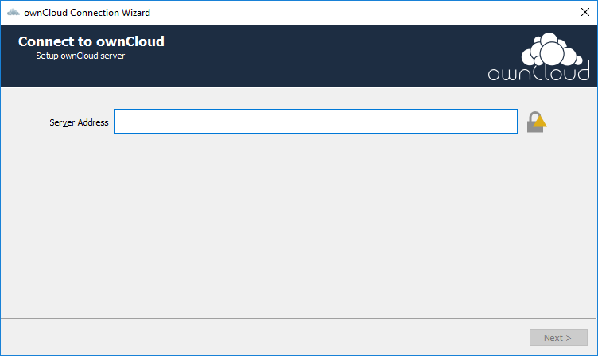
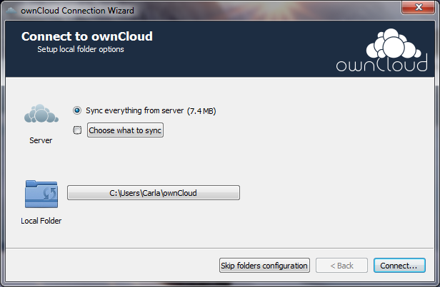

# Step 2: Configure the ownCloud Client
After you have [downloaded and installed the ownCloud client](./qs_users_sysreqs.html), 
you must configure your client to be able to connect to the ownCloud server. 
You configure the client using the configuration program, the **ownCloud Connection 
Wizard**.

## Run the Connection Wizard

1. Your ownCloud administrator has provided you with the following:
   - the address of the ownCloud server (for example, https://studio/owncloud).
   - your ownCloud username and password.

   Contact your ownCloud administrator if you do not have this information.

2. From your Windows Start menu, select **ownCloud**.

   The very first time that you run the ownCloud client, the ownCloud Connection 
   Wizard runs instead.

   

   **NOTE:** If the ownCloud Connection Wizard does not launch, then in the Windows 
   task bar, click the show hidden icons up-arrow, right-click on the ownCloud icon, 
   and select **New Account**.

3. In the **Connect to ownCloud** page, enter the server address and click **Next**.

   

4. On the next wizard page, enter your username and password and click **Next**.

   

5. On the last wizard page, decide:
   - What to sync:
     
     If you do not want to update (sync) everything on your device with the 
     ownCloud server, then click **Choose what to sync**.

   - Where to sync data:

     If you want to use another location on your device other than the default
     (C:\Users\\_username_\ownCloud), then click the path button, and enter a 
     different folder path.

   When you are finished, click **Connect**.

   

   The client attempts to connect to your ownCloud server.
   When the connection is successful you see two buttons:

   - One button enables you to launch the ownCloud client.
   - Another button to open the local folder (the sync folder) on your device.

   The ownCloud client begins synchronizing the data in your local folder with the 
   ownCloud server.
   
6. Be sure to restart your Windows device to enable explorer intergration 
   with ownCloud.

## What's Next?
Congratulations! You have successfully connected to the server. 

To begin using ownCloud, see 
[Using the Synchronization Client](https://doc.owncloud.org/desktop/2.5/navigating.html).
