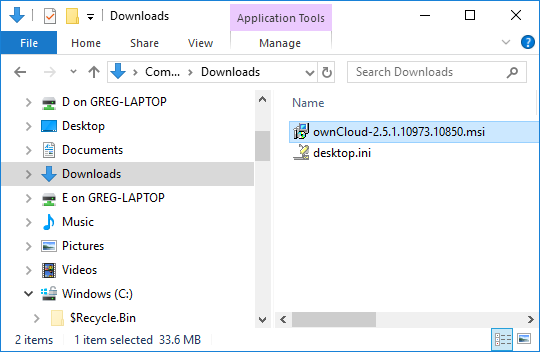

# Step 2: Install the Client
After you have verified that your device meets the necessary [system requirements](./qs_users_sysreqs.html), 
you must install the ownCloud client.

The ownCloud client runs on your workstation, laptop, tablet, and so on and enables 
you to connect to a server where you can use ownCloud.

## Run the Client Installation Wizard
1. Your ownCloud administrator has provided you with the following:
   - the location of the client installation program (ownCloud-x.y.z.msi).
   - the address of the ownCloud server (for example, https://studio/owncloud).
   - your ownCloud username and password.

   Contact your ownCloud administrator if you do not have this information.

2. Open Windows File Explorer, navigate to the folder where the installation program resides, and double-click ownCloud-x.y.z.msi.

   

   After the wizard initializes and installs sever files, you see the ownCloud Connection Wizard, **Connect to ownClud** page.

   

3. Enter the server address and click **Next**.

4. On the next wizard page, enter your username and password and click **Next**.

   

5. On the last wizard page, decide:
   - What to sync:
     
     If you do not want to update (sync) everything on your device with the 
     ownCloud server, then click **Choose what to sync**.

   - Where to sync data:
     If you want to use another location on your device other than the default
     (C:\Users\_username_\ownCloud), then click the path button, and enter a 
     different folder path.

   When you are finished, click **Connect**.

   

   The client attempts to connect to your ownCloud server.
   When the connection is successful you see two buttons:

   - One button enables you to launch the ownCloud client.
   - Another button to open the local folder (the sync folder) on your device.

   The ownCloud client begins synchronizing the data in your local folder with the ownCloud server.
   
## What's Next?
Congratulations! You have successfully installed the client and connected to the server. 

To being using ownCloud, see [Using the Synchronization Client](https://doc.owncloud.org/desktop/2.5/navigating.html).
