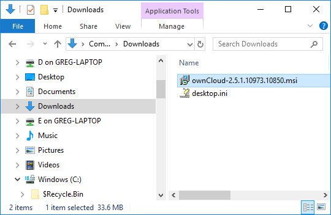
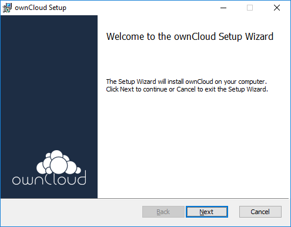
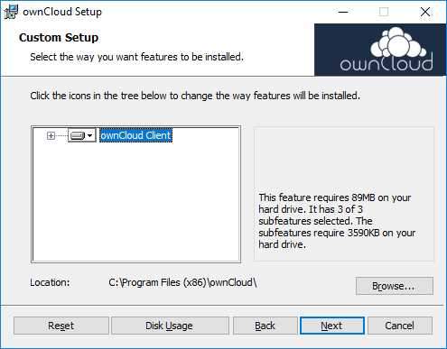
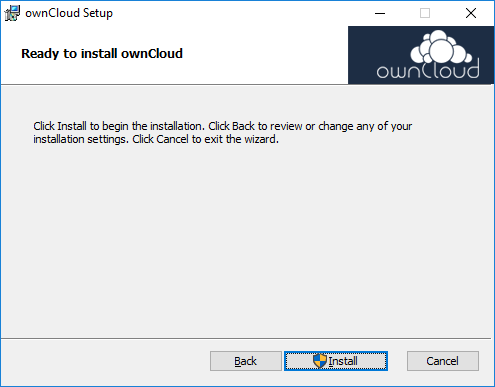
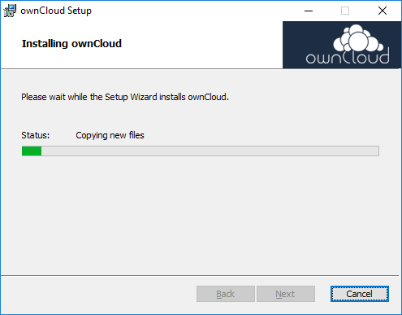
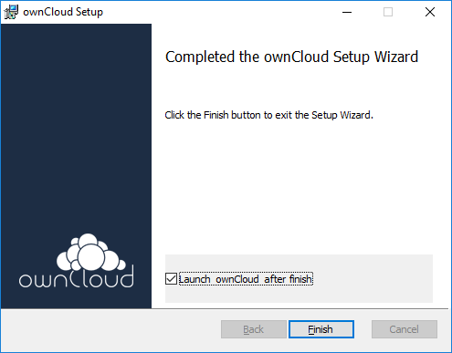
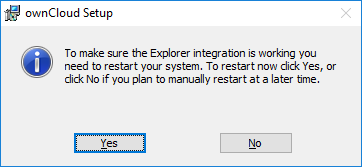

# Step 1: Download and Install the ownCloud Client
The ownCloud client runs on your workstation, laptop, tablet, and so on, and enables 
you to connect to a server where you can use ownCloud.

You download and run the installation program, the **ownCloud Setup Wizard**, 
to install the ownCloud client.

**IMPORTANT: This document is a quickstart for installing the ownCloud client 
on a Windows device. If you are on a non-Windows device, see your ownCloud 
administrator.**


## Download the Client Installation Program
1. **On your Windows device**, open a web browser and go to the following web site:

   ````
   https://owncloud.org/download/#owncloud-desktop-client-windows
   ````
2. In the **ownCloud desktop client for Windows** table, click **Download** 
   for the **Production** release channel.

3. Double-click on the file that you downloaded (for example, ownCloud-2.5.1.10973.10850.msi).

   **Note:** If you cannot double-click on the downloaded file in your web browser, 
   open Windows File Explorer, navigate to the Downloads folder.

   

   The welcome page of the ownCloud Setup Wizard displays.

   

4. Click **Next**.

   The **Custom Setup** page displays.

   
  
5. Click **Next**.

   The **Ready to install ownCloud** page displays.

   

6. Click **Install**.

   The ownCloud Setup program copies ownCloud client files to your device.

   

   When ownCloud setup has finished, you see Completed page.

   

7. Select **Launch ownCloud after finish** and click **Finish**.

   An alert box displays.

   

8. **Important:** click **No**. 

   You will restart your device **after** you complete the next section.

   The first page of the ownCloud Connection Wizard displays.

   Congratulations! You have installed the ownCloud client.

9. **Important:** Do not close the Connection Wizard. Go to [Step 2: Configure the Client](./qs_users_install.html).

